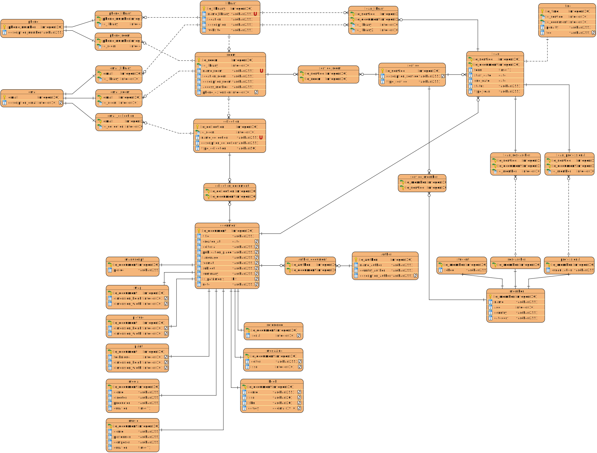

# biblioteca_nacional.sql


## Overview

This project is a comprehensive exploration of SQL and PostgreSQL, featuring:

- A complete **database design** including an Entity Relationship Diagram (ERD)
- Implementation of **optimized queries** and indexing techniques
- Detailed analysis and documentation of **query performance**
- Real-world data modeling challenges and their solutions

The goal was not only to build a robust database but also to document the learning process and performance tuning techniques.

## Table of Contents

- [Features](#features)
- [Technologies](#technologies)
- [Setup & Installation](#setup--installation)
- [Project Structure](#project-structure)
- [Database Design](#database-design)
- [Queries & Optimizations](#queries--optimizations)
- [Lessons Learned](#lessons-learned)
- [Future Enhancements](#future-enhancements)
- [License](#license)
- [Contact](#contact)

## Features

- **ERD and Schema Design**: A visual representation of the database structure.
- **Optimized Queries**: Efficient SQL queries with performance insights.
- **Indexing Strategies**: Implemented indexes to speed up data retrieval.
- **Documentation**: Detailed explanations of design choices and optimization methods.

## Technologies

- **PostgreSQL 16**: The database engine used.
- **SQL**: For data manipulation and querying.

## Setup & Installation

1. **Clone the repository:**

```bash
git clone https://github.com/humankernel/biblioteca.sql.git
cd biblioteca.sql
```

2 **Set up your PostgreSQL environment:**

- Ensure PostgreSQL is installed.
- Create a new database.
- Run the provided SQL scripts to set up the schema and seed data.

## Database Design


